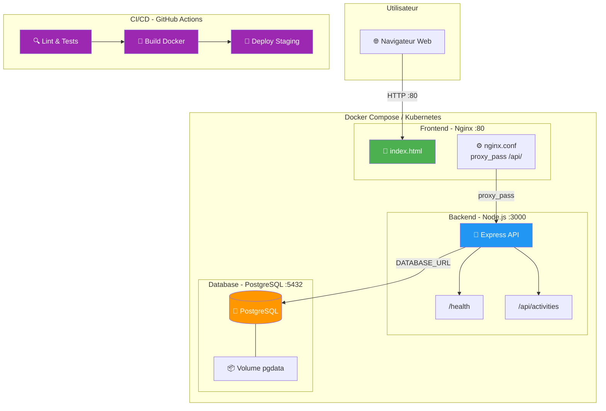
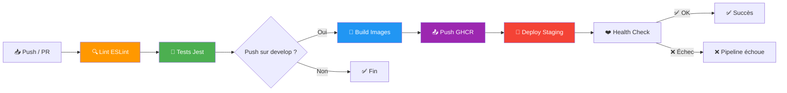

# 🏥 VitalSync - Suivi Médical et Sportif

## 📋 Description du projet

VitalSync est une application de suivi médical et sportif développée par une startup éponyme. L'application permet aux utilisateurs de suivre leurs activités physiques et leurs données de santé via une interface web connectée à une API REST.

### Architecture

L'application est composée de 3 services conteneurisés :

| Service | Technologie | Port | Rôle |
|---------|------------|------|------|
| **Backend** | Node.js / Express | 3000 | API REST (endpoints `/health`, `/api/activities`) |
| **Frontend** | HTML / Nginx | 80 | Interface web avec proxy inverse vers l'API |
| **Database** | PostgreSQL 16 | 5432 | Stockage persistant des données |

### Schéma d'architecture



## 🛠️ Prérequis

| Outil | Version minimale | Vérification |
|-------|-----------------|--------------|
| **Docker** | 24.0+ | `docker --version` |
| **Docker Compose** | 2.20+ | `docker compose version` |
| **Git** | 2.40+ | `git --version` |
| **Node.js** *(optionnel, pour dev local)* | 20.x LTS | `node --version` |
| **npm** *(optionnel, pour dev local)* | 9.x+ | `npm --version` |

## 🚀 Lancer l'application avec Docker Compose

### 1. Cloner le dépôt

```bash
git clone https://github.com/HamzaMrs/Vitalsync.git
cd vitalsync
```

### 2. Configurer les variables d'environnement

```bash
# Copier le fichier d'exemple
cp .env.example .env

# Éditer avec vos propres valeurs
nano .env
```

### 3. Lancer les services

```bash
# Démarrer les 3 services en arrière-plan
docker compose up -d --build

# Vérifier que tout fonctionne
docker compose ps

# Voir les logs en temps réel
docker compose logs -f
```

### 4. Accéder à l'application

- **Frontend** : http://localhost:80
- **API Health** : http://localhost:3000/health
- **API Activities** : http://localhost:3000/api/activities

### 5. Arrêter les services

```bash
# Arrêter sans supprimer les données
docker compose down

# Arrêter ET supprimer les volumes (⚠️ perte de données)
docker compose down -v
```

## 🔄 Pipeline CI/CD

La pipeline CI/CD est configurée avec **GitHub Actions** et se déclenche automatiquement :

| Déclencheur | Étapes exécutées |
|-------------|-----------------|
| Push sur `develop` | Lint → Tests → Build Docker → Push GHCR → Deploy Staging |
| PR vers `main` | Lint → Tests (pas de déploiement) |

### Étapes de la pipeline



### Registry utilisé : GHCR (GitHub Container Registry)

**Justification** : GHCR est intégré nativement à GitHub, ne nécessite pas de compte externe (Docker Hub), et les images sont associées au dépôt. L'authentification utilise le `GITHUB_TOKEN` automatique, évitant la gestion de tokens supplémentaires.

## 📁 Structure du projet

```
vitalsync/
├── .github/
│   └── workflows/
│       └── ci-cd.yml          # Pipeline GitHub Actions
├── backend/
│   ├── server.js              # Serveur Express (API REST)
│   ├── package.json           # Dépendances Node.js
│   ├── Dockerfile             # Multi-stage build (test + prod)
│   ├── .dockerignore          # Fichiers exclus du build Docker
│   ├── .eslintrc.json         # Configuration ESLint
│   └── test/
│       └── health.test.js     # Tests unitaires Jest
├── frontend/
│   ├── index.html             # Interface web
│   ├── nginx.conf             # Configuration Nginx + proxy_pass
│   └── Dockerfile             # Image Nginx Alpine
├── k8s/
│   ├── backend-deployment.yaml  # Deployment K8s (2 réplicas)
│   ├── backend-service.yaml     # Service ClusterIP
│   ├── frontend-service.yaml    # Service ClusterIP frontend
│   ├── ingress.yaml             # Ingress Nginx
│   └── db-secret.yaml           # Secret PostgreSQL
├── .env.example               # Variables d'environnement (template)
├── .gitignore                 # Fichiers exclus de Git
├── docker-compose.yml         # Orchestration des 3 services
└── README.md                  # Ce fichier
```

## 🔧 Choix techniques et justifications

| Choix | Justification |
|-------|--------------|
| **GitHub** (vs GitLab) | Écosystème Actions intégré, GHCR natif, large communauté, intégration directe avec les PR |
| **GitHub Actions** (vs GitLab CI) | Natif à GitHub, gratuit pour les dépôts publics, marketplace d'actions réutilisables |
| **Node.js 20 Alpine** | Version LTS stable, image Alpine ~5x plus légère que l'image standard (~180 Mo vs ~900 Mo) |
| **Nginx stable-alpine** | Serveur web performant et léger, proxy inverse intégré, image ~25 Mo |
| **PostgreSQL 16 Alpine** | Dernière version stable, image Alpine légère, performances optimisées |
| **Multi-stage Docker build** | Sépare build/test et production, réduit taille image et surface d'attaque |
| **GHCR** (vs Docker Hub) | Intégré à GitHub, pas de limite de pull, authentification via GITHUB_TOKEN |
| **Gitflow** (branching) | Standard industriel, sépare clairement développement, releases et hotfixes |
| **Conventional Commits** | Historique lisible, génération automatique de changelogs possible |
| **Kubernetes Ingress** (vs NodePort) | URL standard HTTP/HTTPS, routing par path, support TLS, point d'entrée unique |

## 🏗️ Kubernetes

Les manifestes Kubernetes sont dans le dossier `k8s/`. Pour les appliquer :

```bash
# Créer le namespace
kubectl create namespace vitalsync

# Appliquer les manifestes
kubectl apply -f k8s/

# Vérifier le déploiement
kubectl get all -n vitalsync
```

## 📄 Licence

Projet réalisé dans le cadre de l'épreuve E6 – EFREI 2026.
